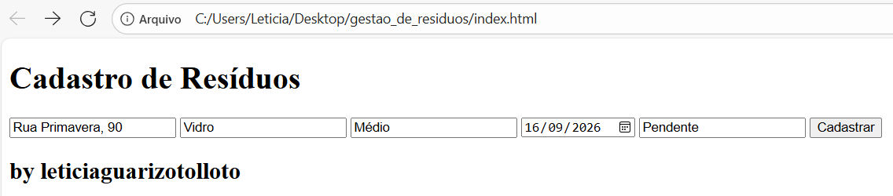
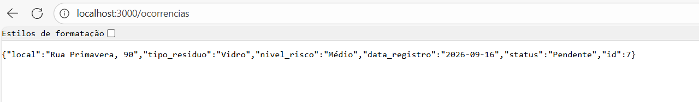
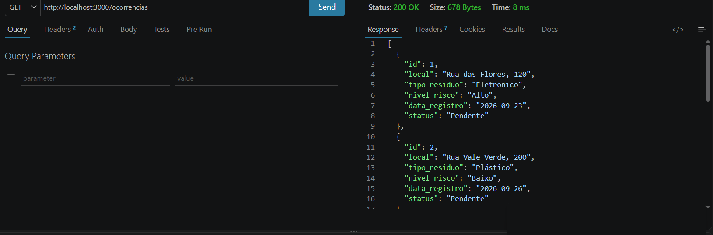
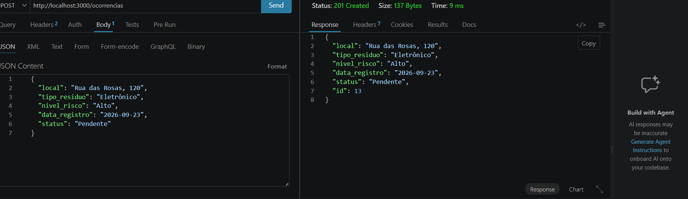
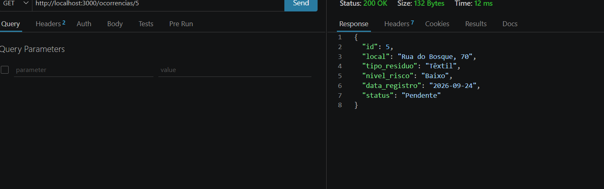
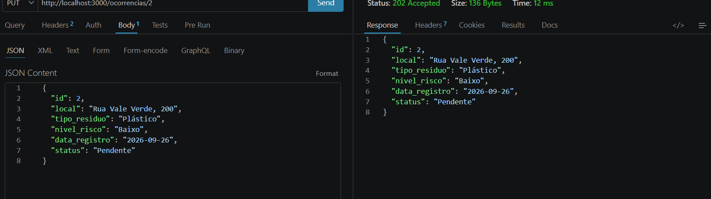
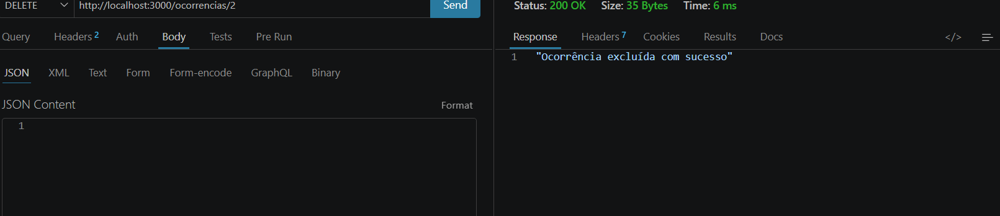

# ♻️ Gestão de Resíduos

Projeto desenvolvido para o **PBE1 - VPS01 2026**, com o objetivo de criar uma aplicação simples para o **cadastro e gerenciamento de resíduos**.

O sistema permite registrar informações sobre resíduos, consultar os registros cadastrados, buscar registros específicos, atualizar informações e excluir registros.

## 📌 Sobre o projeto

A aplicação foi desenvolvida utilizando **Node.js** e **Express**, com os dados armazenados inicialmente em um arquivo JSON.

Cada registro de resíduo possui informações como:

* 📍 Local
* ♻️ Tipo de resíduo
* ⚠️ Nível de risco
* 📅 Data de registro
* 🔄 Status

## 🚀 Funcionalidades

A aplicação possui as seguintes operações:

* **GET** — consultar todos os resíduos cadastrados;
* **POST** — cadastrar um novo resíduo;
* **GET por busca** — pesquisar um resíduo específico;
* **PUT** — atualizar os dados de um resíduo;
* **DELETE** — excluir um resíduo.

## 🛠️ Tecnologias utilizadas

* HTML
* JavaScript
* Node.js
* Express
* JSON
* Thunder Client
* Git e GitHub

## 📂 Estrutura do projeto

```text
sesi_pbe1_vps01_gestao_de_residuos_2026/
│
├── dados.json
├── index.html
├── server.js
├── package.json
├── BUSCAR.png
├── DELETE.png
├── GET.png
├── INDEX.png
├── POST.png
├── RESPOSTAINDEX.png
└── UPDATE.png
```

## ▶️ Como executar o projeto

### 1. Instalar as dependências

Abra o terminal na pasta do projeto e execute:

```bash
npm install
```

### 2. Iniciar o servidor

Execute:

```bash
node server.js
```

O servidor será iniciado na porta **3000**.

A aplicação pode ser acessada pelo navegador através de:

```text
http://localhost:3000
```

## 📸 Demonstração

### Página inicial



### Resposta da página inicial



### GET — Consulta dos resíduos



### POST — Cadastro de resíduo



### BUSCAR — Pesquisa de resíduo



### UPDATE — Atualização de resíduo



### DELETE — Exclusão de resíduo



## 🎯 Objetivo

O projeto tem como objetivo aplicar na prática os conhecime
